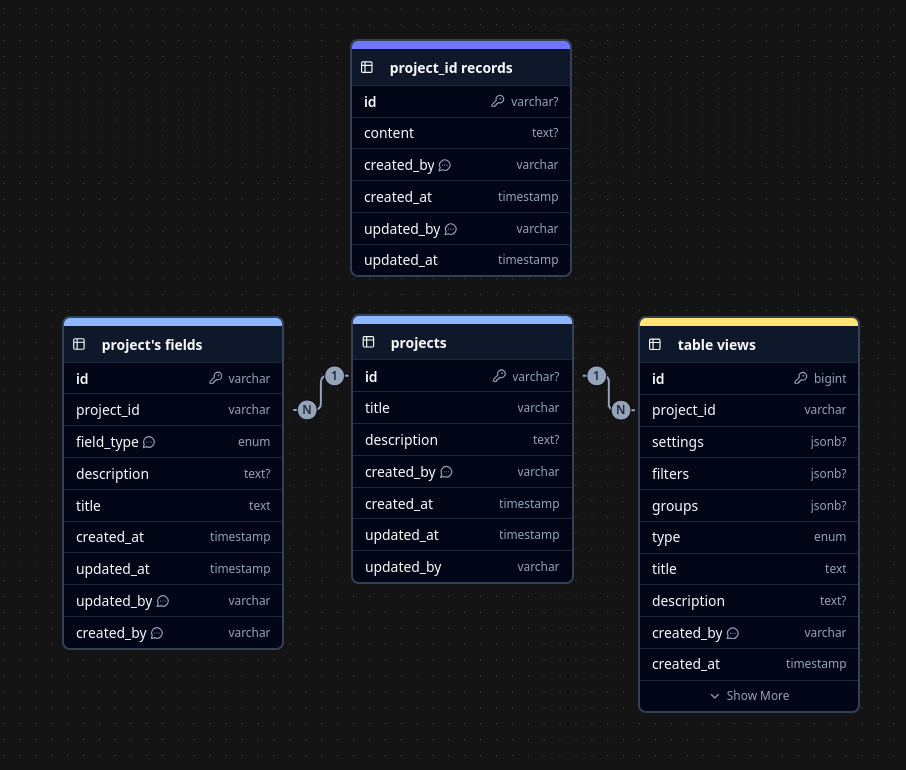

# Структура
Работа с анкетами: создание, редактирование, построение графиков, сравнение и т.д. - работа с данными, которые описываются в табличном виде.

Тогда вместо создания анкет, можно создать таблицу, по которой уже сделать любое её представление: график, анкету, отфильтрованную другую таблицу или таблицу, где что-то сгруппировано. Т.е. поступить подобно тому, как во всяких notion сделано: сначала создаётся таблица, а для неё представления.

# Пример использования
Каждую анкету назовём проектом, которая по умолчанию имеет вид пустой таблицы.

1. Пользователь создаёт новый проект с названием, допустим, "Архангельск", видит пустую созданную таблицу,
2. добавляет в неё колонки (поля): время отправки, прибытия, время в пути, имя, почта, возраст, пол. 
3. создаёт вид для проекта типа "Опрос" с названием "Статистика маршрутов" (или анкета, как угодно), добавляет в неё поля, которые ранее создал, настраивает доступ к этой анкете, правит специально для анкеты названия полей и т.д.
4. импортировав самостоятельно, заполнив вручную или собрав с анкеты данные, которые он может видеть в таблице из пункта 1, создаёт новый вид "Календарь", чтобы посмотреть динамику заполнения анкеты (сколько человек в какой день заполнянли)
5. Допустим, потом создаёт вид "Столбчатый график" и выбирает для него те числовые колнки (поля), что доступны в проекте
6. Или создаёт другую таблицу, где сохраняет фильтр или группу

Потом в другом проекте (например, Норильск) можно будет объединять колонки с колонками из проекта "Архангельск", настраивать отдельно права доступа и всё такое.

# Примерная схема базы данных

- проекты: собственно проекты
- поля проекта: какие колонки каких типов и с какой информацией созданы для заполнения и аналитики в проекте
- представления проекта: виды таблицы, графика, анкеты, календаря, может карты; и их настройки
- записи проекта: каждый раз отдельная таблица с заполненными данными проекта в соответствии со схемой проекта (т.е. по настроенным полям проекта) 

Помимо этого на каждую таблицу надо прикрутить версионирование, информацию о доступе групп пользователей. Можно добавить систему комменирования к чему угодно, защиту паролем для вида "анкета" и много чего, хватило бы сил и воображения.

Таблица однозначно будет сильно изменяться и страшно разрастаться, потому что я не могу и не знаю, как максимально детально это расписать всё: зависит от реализации модуля пользователя, потребностей и т.п.

---

До 3го уровня по C4 у меня долезть не получилось. Тут +/- уже и так понятно как оно будет